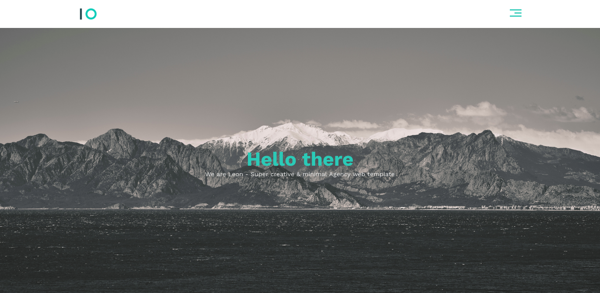

# Leon template HTML & CSS learning

Responsive webpage with HTML and CSS and learning in the course of [Elzero Web school](https://github.com/ElzeroWebSchool).

## Table of contents

- [Overview](#overview)
  - [The challenge](#the-challenge)
  - [Links](#links)
- [My process](#my-process)
  - [Built with](#built-with)
  - [Useful resources](#useful-resources)
- [Author](#author)

## Overview

### The challenge

Users should be able to:

- View the optimal layout for the section depending on their device's screen size

### Links

- Solution URL: [Add solution URL here](https://your-solution-url.com)
- Live Site URL: [Add live site URL here](https://your-live-site-url.com)

## My process

### Built with

- Semantic HTML5 markup
- CSS custom properties
- Flexbox
- CSS Grid

### Useful resources

- [structur](https://www.youtube.com/playlist?list=PLDoPjvoNmBAzHSjcR-HnW9tnxyuye8KbF) - her you can see the structur of building the webpage. 

